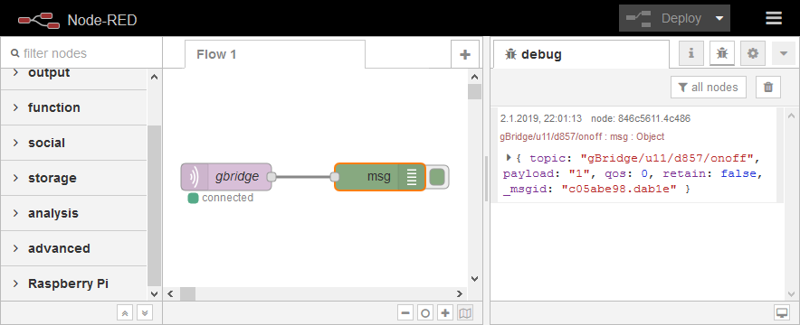

Node-RED integration
=======================

This guide helps you to connect to gBridge with you Node-RED instance.

Place a new MQTT input node. Enter the action topic of a device you've created in the gBridge device dashboard. Create a new MQTT server connection by following the next chapter (or choose the previously configured one).

MQTT broker setup
------------------

.. figure:: ../_static/nodered-mqtt.png
   :width: 100%
   :align: center
   :alt: Node-RED MQTT setup.
   :figclass: align-center

   Use :code:`mqtt.gbridge.io` as the MQTT server, 8883 as the MQTT port. Enable legacy MQTT v3.1. Enable the usage of a secure TLS connection and create a new TLS profile.

.. figure:: ../_static/nodered-mqtt-tls.png
   :width: 100%
   :align: center
   :alt: Node-RED MQTT TLS setup.
   :figclass: align-center

   Use :code:`mqtt.gbridge.io` as the server name, check "Verify server certificate". Choose a name you like (e.g. "gbridge-tls"). You don't need to upload any custom certificates here.

.. figure:: ../_static/nodered-mqtt-auth.png
   :width: 100%
   :align: center
   :alt: Node-RED MQTT authentication.
   :figclass: align-center

   Go back to the broker setting, into the tab "Security". Enter your gBridge MQTT username (it is listed in your account's dashboard in "My Account") and password. Your MQTT password is you account's password by default, but may be changed independently.

.. warning::
    `Some users <https://github.com/kservices/gBridge/issues/13>`_ have discovered that Node-RED won't connect to the gBridge MQTT broker if you password contains certain special characters. :code:`$` is known to cause issues. Try changing your password if Node-RED won't connect.

Test it
-----------

I've just created a new device called "Ceiling Light" in my gBridge dashboard. After setting it up on Node-RED, I connected it to a debug node in order to see the messages.

.. figure:: ../_static/nodered-success-command.png
   :width: 100%
   :align: center
   :alt: Node-RED Google Assistant command.
   :figclass: align-center

   I've asked Google to turn the device on.

   A MQTT message is received when Google issues a command.
